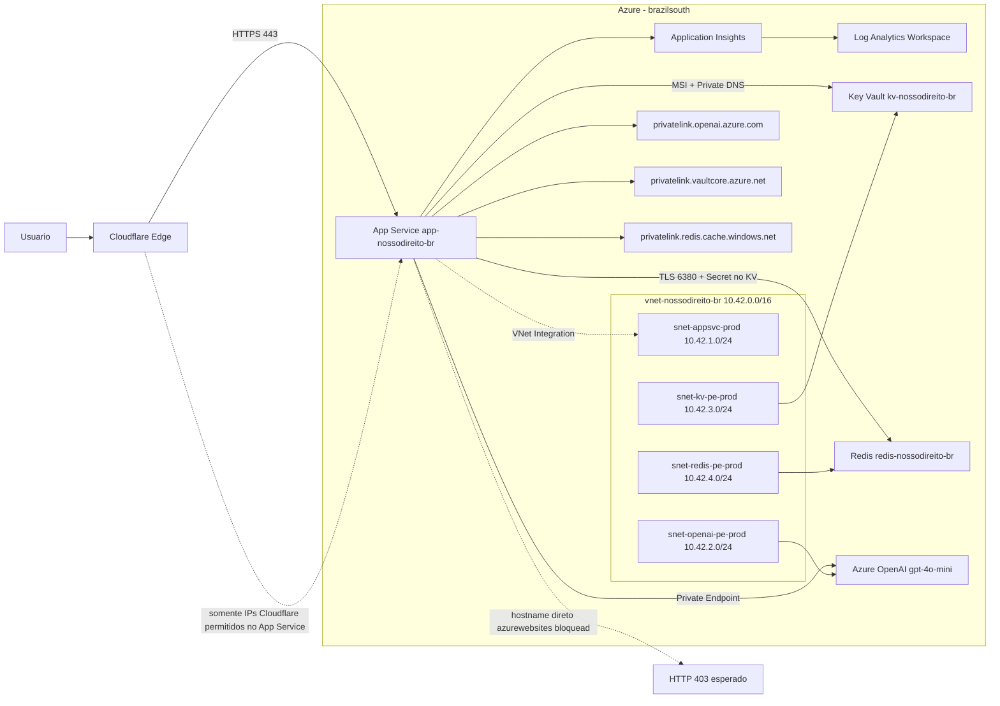

# Arquitetura Atual — NossoDireito

**Version:** 1.33.2
**Updated:** 2026-05-24

## Visao Geral

A plataforma roda em Azure App Service Linux (Node.js 22) com entrega via dominio customizado em Cloudflare. O backend expoe conteudo estatico e a API de analise por IA com opt-in explicito, usando Azure OpenAI em modo privado.

## Topologia de Execucao

- Borda: Cloudflare (DNS, CDN, WAF, TLS)
- Aplicacao: Azure App Service (`app-nossodireito-br`)
- Runtime: Node.js 22 LTS
- Regiao: Brazil South (`brazilsouth`)
- Observabilidade: Application Insights + Log Analytics
- Segredos: Azure Key Vault + Managed Identity
- Cache/rate limit: Azure Cache for Redis (TLS 1.2)
- Rede privada: VNet + subnets dedicadas + Private Endpoints
- DNS privado: zonas `privatelink.*` para OpenAI, Key Vault e Redis
- CI/CD: GitHub Actions com OIDC

## Inventario de Infraestrutura (Atual)

- Resource Group: `rg-nossodireito-br`
- App Service Plan: `plan-nossodireito-br` (Linux, B1)
- App Service: `app-nossodireito-br`
- Azure OpenAI: `cog-nossodireito-br-openai` (deployment `gpt-4o-mini`)
- Key Vault: `kv-nossodireito-br`
- Redis: `redis-nossodireito-br`
- VNet: `vnet-nossodireito-br` (`10.42.0.0/16`)
- Subnet App Service Integration: `snet-appsvc-prod` (`10.42.1.0/24`)
- Subnet OpenAI PE: `snet-openai-pe-prod` (`10.42.2.0/24`)
- Subnet Key Vault PE: `snet-kv-pe-prod` (`10.42.3.0/24`)
- Subnet Redis PE: `snet-redis-pe-prod` (`10.42.4.0/24`)

## Diagrama Mermaid (Infra E2E)



## Fluxo de Requisicao

1. Usuario acessa `https://nossodireito.fabiotreze.com`.
2. Cloudflare aplica protecao de borda e encaminha para App Service.
3. O App Service entrega UI/PWA e ativos versionados.
4. Em analise por IA, o frontend exige consentimento explicito.
5. O backend anonimiza o texto e chama Azure OpenAI via Private Endpoint.
6. A resposta volta para o cliente sem persistencia de dados pessoais no servidor.

## API e Endpoints

- `GET /` -> aplicacao web
- `GET /health` -> health check da aplicacao
- `GET /direitos/<slug>/` -> pagina estatica SEO de um direito (1 por categoria)
- `POST /api/analyze-document` -> analise de texto com IA (opt-in)
- `GET /data/*.json` -> base de direitos e mecanismos de busca

## SEO — Paginas Pre-renderizadas

Para evitar o problema de SPA com hash-routing (Google indexa apenas `/`),
o repositorio mantem 42 paginas HTML estaticas em `direitos/<slug>/index.html`,
geradas a partir de `data/direitos.json` pelo script `scripts/prerender_direitos.py`.

Cada pagina contem: title/description/canonical unicos, H1 com o titulo da
categoria, secoes Base legal/Requisitos/Documentos/Passo-a-passo, JSON-LD
Article + BreadcrumbList, link de retorno para a home. Sao paginas leves
(~13 KB) sem dependencia da SPA — Googlebot indexa diretamente.

`server.js` resolve URLs limpas via `resolveFile`: requisicoes sem extensao
(ex. `/direitos/bpc/`) tentam `<path>/index.html` -> `<path>.html` -> fallback SPA.

`sitemap.xml` lista as 43 URLs (home + 42 direitos) e e regenerado pelo mesmo
script. `master_compliance.py` valida sincronia (paginas presentes + sitemap
atualizado) na categoria SEO.

Regenerar apos editar `data/direitos.json`:
```bash
python3 scripts/prerender_direitos.py
```

## Privacidade e LGPD

- Coleta de dados pessoais: nao
- Consentimento para IA: obrigatorio, especifico e revogavel
- Revogacao de consentimento: disponivel permanentemente na interface
- Base legal da analise de IA: consentimento (LGPD Art. 7o, I)
- Tratamento: anonimizado antes de envio ao provedor de IA

## Seguranca Aplicada

- HTTPS obrigatorio
- Security headers no servidor (CSP, HSTS, X-Content-Type-Options, X-Frame-Options, Referrer-Policy)
- Rate limiting para endpoint de IA
- Managed Identity para acesso a recursos Azure
- App Service com allowlist de IPs Cloudflare e default deny
- OpenAI, Key Vault e Redis com conectividade privada
- Sem secrets de producao hardcoded no codigo

## Observacoes de Operacao

- O hostname direto do App Service (`*.azurewebsites.net`) deve retornar 403 por hardening.
- O endpoint publico oficial e o dominio customizado em Cloudflare.
- O Key Vault roda privado por padrao (`public_network_access_enabled=false`).
- O segredo `redis-primary-key` permanece como referencia de app setting, mas por padrao nao e gerenciado via Terraform (`manage_redis_secret_with_terraform=false`) para evitar falha de data-plane em runners fora da VNet.

## Gates de Qualidade (CI/CD)

Desde v1.33.x, todo PR para `main` precisa passar nos 7 required checks abaixo antes do merge (configurado em branch protection):

| Check                                       | Ferramenta                       | Bloqueia? |
| ------------------------------------------- | -------------------------------- | --------- |
| `CodeQL`                                    | GitHub Code Scanning (py + js/ts)| sim       |
| `gitleaks scan`                             | gitleaks                         | sim       |
| `Quality Gate (36 categorias)`              | `scripts/master_compliance.py`   | sim       |
| `Lighthouse (perf/seo/a11y/bp/pwa)`         | `@lhci/cli` + `lighthouserc.json`| sim       |
| `A11y (axe-core WCAG 2.1 AA) (chromium)`    | `tests/a11y.mjs` + Playwright    | sim       |
| `A11y (axe-core WCAG 2.1 AA) (firefox)`     | `tests/a11y.mjs` + Playwright    | sim       |
| `A11y (axe-core WCAG 2.1 AA) (webkit)`      | `tests/a11y.mjs` + Playwright    | sim       |

Thresholds atuais (Lighthouse): perf ≥ 0.85, a11y ≥ 0.90, best-practices ≥ 0.90, seo ≥ 0.90, pwa ≥ 0.50 (warn). 4 URLs auditadas: home, `direitos/bpc/`, `direitos/educacao/`, `direitos/moradia_assistida_pcd/`.

Testes PWA reais em `tests/test_e2e_playwright.py::TestPWA` validam `manifest.json` (campos + ícone ≥192px), `sw.js` (Content-Type + `CACHE_VERSION`) e fallback offline via `page.context.set_offline(True)`.

Master Compliance score atual: **1263.5 / 1267.5 = 99.68%** (36 categorias).

## Diagramas

- Arquitetura E2E: [ARCHITECTURE.drawio](ARCHITECTURE.drawio)
- Fluxo de IA: [diagrams/02-ia-flow.drawio](diagrams/02-ia-flow.drawio)
- Replicacao: [diagrams/03-replication.drawio](diagrams/03-replication.drawio)

## Referencias de Infra (Terraform)

- [terraform/main.tf](../terraform/main.tf)
- [terraform/openai-private-network.tf](../terraform/openai-private-network.tf)
- [terraform/keyvault-redis-private-network.tf](../terraform/keyvault-redis-private-network.tf)
- [terraform/variables.tf](../terraform/variables.tf)
- [terraform/outputs.tf](../terraform/outputs.tf)

## Referencias Operacionais

- Operacao e runbook: [OPERATIONS.md](OPERATIONS.md)
- Seguranca e LGPD: [SECURITY-LGPD.md](SECURITY-LGPD.md)
- Replicacao: [REPLICATION.md](REPLICATION.md)
