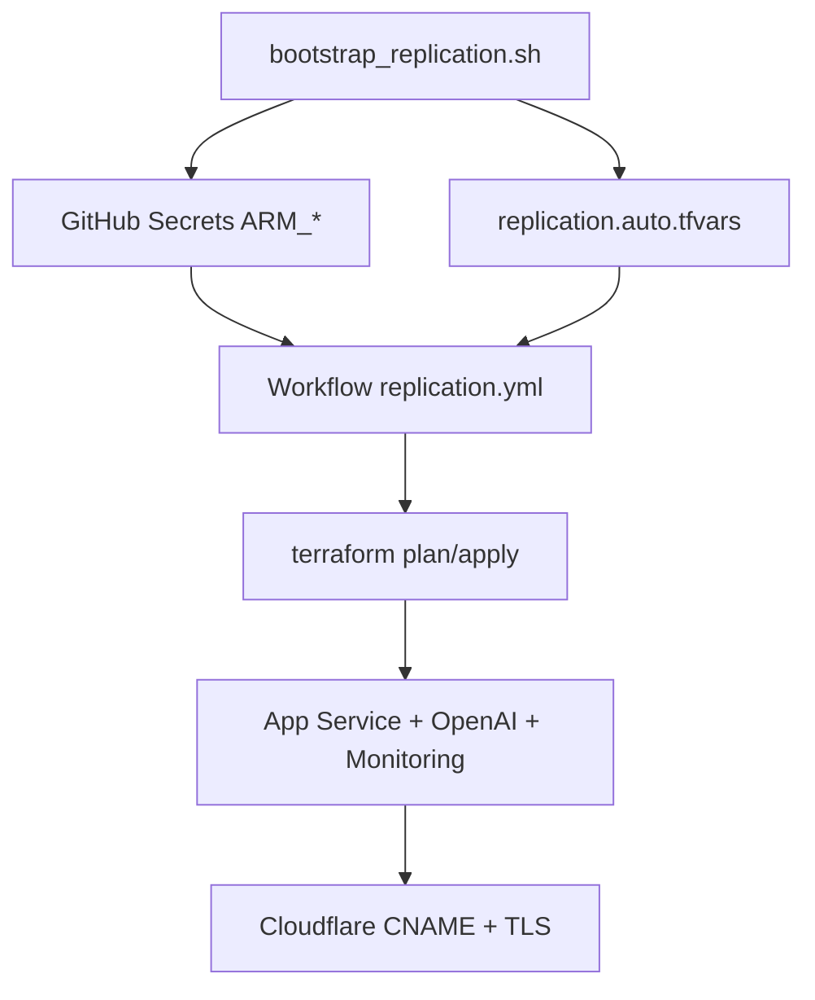

## Replication Guide (New Tenant / New Subscription)

**Version:** 1.20.0
**Updated:** 2026-05-18

## Goal

Replicate this solution with minimal manual work in another tenant/subscription, preserving the same architecture and deployment model.

## Inputs Required

- Azure `subscription_id`
- Azure `tenant_id`
- Entra App Registration `client_id` for OIDC
- `project_name` (resource naming base)
- `custom_domain` (for hostname/cert binding)

## Network and Secret Posture (v1.19.0)

- OpenAI, Key Vault e Redis usam Private Endpoint + Private DNS por padrao.
- O App Service continua publico via dominio customizado, com acesso direto restrito a IPs Cloudflare.
- Em runners fora da VNet, manter `manage_redis_secret_with_terraform=false` para evitar erro 403 em Key Vault privado.

## Bootstrap Automation

Run from repository root:

```bash
bash scripts/bootstrap_replication.sh \
  --subscription-id <SUB_ID> \
  --tenant-id <TENANT_ID> \
  --client-id <CLIENT_ID> \
  --project-name <PROJECT_NAME> \
  --custom-domain <DOMAIN>
```

What the script does:

1. Sets GitHub secrets (`ARM_*`)
2. Writes `terraform/replication.auto.tfvars`
3. Prints next DNS/cert actions

## Terraform Workflow (GitHub)

Manual workflow for replicated environments:

- Workflow: `.github/workflows/replication.yml`
- Inputs: environment, project_name, custom_domain, location, action (`plan|apply`)
- Authentication: OIDC (`azure/login`)



## DNS and Certificate (Cloudflare)

1. Create CNAME:
   - Name: host portion of custom domain
   - Target: `app-<project_name>.azurewebsites.net`
2. Start with `DNS only` until hostname validation completes
3. Set SSL mode to `Full (strict)`
4. If using custom PFX:
   - Set `PFX_BASE64` and `TF_VAR_PFX_PASSWORD` as GitHub secrets

### Azure Managed Certificate (sem PFX)

1. Keep `enable_keyvault = false` when you do not need custom certificate import.
2. After hostname binding is validated, create managed cert in App Service:
   - Portal: TLS/SSL settings -> Private Key Certificates -> Create App Service Managed Certificate
3. Bind managed cert to the custom hostname with SNI SSL.
4. Keep Cloudflare SSL mode at `Full (strict)`.

## Fast Validation

```bash
curl -sI https://<custom-domain>/
curl -sI https://app-<project_name>.azurewebsites.net/
```

## DR Notes

- Infra is reproducible from Terraform
- No server-side user data migration required
- Preserve or export monitoring history if needed before tenant switch
