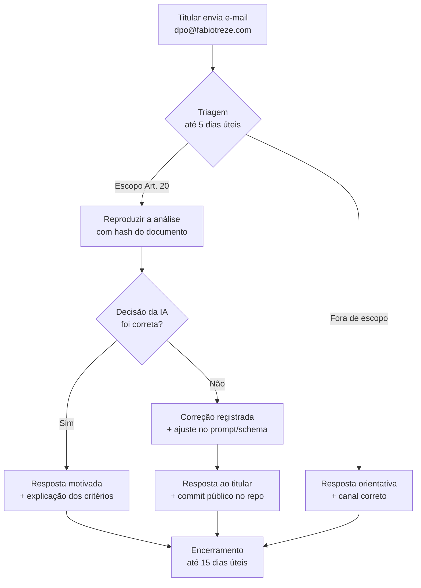

# Revisão Humana de Decisões Automatizadas — Art. 20 da LGPD

> **Base legal:** Lei 13.709/2018 (LGPD), Art. 20: o titular dos dados tem
> direito a solicitar a revisão, por pessoa natural, de decisões tomadas
> unicamente com base em tratamento automatizado de dados pessoais que
> afetem seus interesses.
>
> **Aplicação no NossoDireito:** a análise opcional de documentos por IA
> generativa (Azure OpenAI gpt-4o-mini) é uma decisão automatizada na
> medida em que sugere CIDs, categorias de direito e elegibilidade. Este
> documento descreve o canal, o fluxo, o SLA e o tratamento dos pedidos
> de revisão humana.

**Versão:** 1.43.48
**Última revisão:** 2026-06-07
**Responsável:** Encarregado pelo Tratamento de Dados Pessoais (DPO)

---

## 1. Canal único de solicitação

| Campo | Valor |
|-------|-------|
| **E-mail** | `dpo@fabiotreze.com` |
| **Assunto sugerido** | `[Revisão Art. 20 LGPD] <breve descrição>` |
| **Idioma** | Português (pt-BR) |
| **Custo** | Gratuito |
| **Identificação obrigatória** | E-mail válido para retorno (sem CPF/RG) |

> O NossoDireito **não tem outro canal** (telefone, chat, formulário). Isso é
> proposital: e-mail garante rastro auditável e dispensa coleta adicional de
> dados pessoais.

## 2. O que pode ser revisto

| Categoria | Exemplo | Aceita revisão? |
|-----------|---------|-----------------|
| Sugestão de CID incorreta | "IA sugeriu F84.0 quando o laudo diz F84.5" | ✅ |
| Categoria de direito sugerida sem base | "IA sugeriu BPC sem evidência no documento" | ✅ |
| Mensagem rejeitando documento legítimo | "IA disse que não há CID, mas o laudo tem" | ✅ |
| Recusa de processar (rate-limit, tamanho) | "Recebi 429 ou 413" | ❌ (problema técnico, não decisão) |
| Conteúdo dos direitos exibidos no portal | "Discordo do texto sobre BPC LOAS" | ❌ (encaminhado a [revisão de conteúdo](https://github.com/fabiotreze/nossodireito/issues)) |
| Mérito jurídico da elegibilidade | "Tenho direito ou não a esse benefício?" | ❌ (não é função da IA — orientar a Defensoria) |

## 3. Fluxo operacional

### 3.1 Etapas detalhadas

1. **Recebimento (D+0)** — DPO confirma recebimento em até 1 dia útil.
2. **Triagem (D+1 a D+5)** — DPO classifica em escopo / fora de escopo.
3. **Reprodução (D+5 a D+10)** — quando em escopo, DPO reproduz a análise
   localmente usando o texto fornecido pelo titular (anonimizado).
4. **Decisão (D+10 a D+15)** — DPO responde por e-mail com:
   - Resumo da análise reproduzida;
   - Critérios usados pela IA (schema + prompt aplicável);
   - Se houve erro: ação corretiva (ex.: ajuste de enum, novo few-shot, etc.);
   - Direito do titular a recorrer à [ANPD](https://www.gov.br/anpd) se discordar.

## 4. SLA

| Marco | Prazo máximo | Base |
|-------|--------------|------|
| Confirmação de recebimento | 1 dia útil | Boa prática (LGPD Art. 18, §5º — 15 dias) |
| Resposta de triagem | 5 dias úteis | Idem |
| Resposta final motivada | 15 dias úteis | LGPD Art. 18, §5º |

> O prazo de 15 dias úteis é o **máximo legal**. O DPO se compromete com
> esforço razoável para responder antes, na medida da fila e da
> complexidade.

## 5. Registro auditável

Cada solicitação tem 3 registros públicos pseudonimizados:

- **Issue privada interna** no repositório (estado, datas, decisão);
- **Arquivo de auditoria** em `docs/auditorias-art20/AAAA-MM-DD-<hash>.md`
  (após anonimização — sem texto do documento original);
- **Métrica agregada** no relatório anual de transparência:
  total de pedidos, % em escopo, % com correção aplicada, tempo médio.

## 6. Limites do processo

- O DPO atua sozinho (sem comitê). Em caso de conflito de interesse,
  a solicitação é encaminhada à [Defensoria Pública da União](https://www.dpu.def.br).
- O NossoDireito **não substitui** parecer jurídico. Decisões sobre o
  mérito do benefício (BPC, CIPTEA, etc.) cabem ao órgão competente
  (INSS, secretaria de saúde, etc.).
- O DPO **não tem acesso** aos documentos originais dos titulares
  (anonimização ocorre client-side antes do envio à IA). A revisão é
  feita com o que o titular voluntariamente reenvia no e-mail.

## 7. Relação com outros canais

| Para que serve | Canal |
|----------------|-------|
| Revisão Art. 20 LGPD (esta página) | `dpo@fabiotreze.com` |
| Bug do site, erro de exibição | [GitHub Issues](https://github.com/fabiotreze/nossodireito/issues) |
| Dúvida jurídica sobre direitos | [Defensoria Pública](https://www.dpu.def.br) |
| Denúncia à autoridade | [ANPD](https://www.gov.br/anpd) |

---

**Referências normativas**

- Lei 13.709/2018 (LGPD), Art. 20 e Art. 18, §5º
- Resolução CD/ANPD nº 4/2023 (RIPD)
- Guia ANPD: "Direitos dos titulares" (versão 2024)
