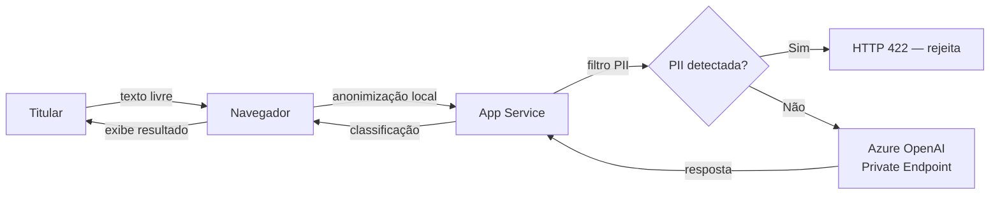

# RIPD — Relatório de Impacto à Proteção de Dados Pessoais

> Documento exigido pela LGPD Art. 38 e regulamentado pela Resolução
> CD/ANPD nº 4/2023 para tratamentos que possam gerar riscos às
> liberdades civis e aos direitos fundamentais dos titulares.

**Versão:** 1.43.48  
**Data:** 2026-06-07  
**Controlador:** Fabio Rodrigues Vieira Costa  
**Encarregado (DPO):** Fabio Rodrigues Vieira Costa — `dpo@fabiotreze.com`  
**Portal:** [nossodireito.fabiotreze.com](https://nossodireito.fabiotreze.com)

---

## 1. Identificação do tratamento

| Campo | Descrição |
|-------|-----------|
| Nome do tratamento | Análise opcional de documentos por IA generativa |
| Natureza | Classificação assistida de direitos PcD com base em texto fornecido pelo titular |
| Escopo | Texto livre inserido pelo titular via formulário no navegador |
| Contexto | Portal informativo sobre direitos de pessoas com deficiência |
| Finalidade | Auxiliar o titular a identificar direitos aplicáveis à sua situação |

## 2. Necessidade e proporcionalidade

| Critério | Avaliação |
|----------|-----------|
| Base legal | Consentimento livre, informado e específico (Art. 7º, I; Art. 8º; Art. 11, II, a) |
| Minimização | Apenas o texto inserido é processado; rejeição automática de PII evidente (CPF, RG, e-mail) |
| Limitação de finalidade | Uso exclusivo para classificação de direitos; sem perfilamento, marketing ou score |
| Limitação de armazenamento | Sem retenção de prompt/resposta em qualquer camada (Azure OpenAI, Redis, App Service) |
| Qualidade dos dados | Texto fornecido pelo titular sem enriquecimento externo |

## 3. Classificação de risco (Res. CD/ANPD nº 2/2022, Art. 3)

O tratamento NÃO se enquadra como agente de pequeno porte porque:

| Critério excludente | Aplicabilidade |
|---------------------|----------------|
| Art. 3, I — dados sensíveis (saúde/CIDs) | **Sim** — titular pode inserir CIDs, laudos, diagnósticos |
| Art. 3, I — idosos | **Sim** — BPC 65+ é direito coberto |
| Art. 3, I — crianças/adolescentes | **Sim** — CIPTEA (TEA) afeta menores |
| Art. 3, II — tecnologia emergente (IA generativa) | **Sim** — Azure OpenAI GPT-4o |
| Art. 3, III — vigilância/decisões automatizadas com efeito significativo | **Parcial** — a decisão é informativa, sem efeito jurídico vinculante |

**Conclusão:** tratamento de ALTO RISCO — RIPD obrigatório.

## 4. Identificação dos riscos

| # | Risco | Probabilidade | Impacto | Nível |
|---|-------|---------------|---------|-------|
| R1 | Titular insere PII sensível (laudo médico completo) e dado trafega ao Azure OpenAI | Média | Alto | Alto |
| R2 | Resposta da IA contém orientação incorreta e titular deixa de buscar atendimento | Baixa | Alto | Médio |
| R3 | Vazamento de dados em trânsito por falha TLS | Muito baixa | Alto | Baixo |
| R4 | Acesso não autorizado ao ambiente Azure (Key Vault, OpenAI) | Muito baixa | Alto | Baixo |
| R5 | Reidentificação a partir de telemetria operacional | **Eliminado** (telemetria desativada em 2026-06-05) | Médio | Eliminado |

## 5. Medidas de mitigação

| Risco | Medida | Status |
|-------|--------|--------|
| R1 | Filtro de PII no servidor rejeita payloads com CPF, RG, e-mail (HTTP 422) | ✅ Implementado |
| R1 | Anonimização client-side antes do envio | ✅ Implementado |
| R1 | Azure OpenAI com `publicNetworkAccess=Disabled` + Private Endpoint | ✅ Implementado |
| R1 | Sem retenção de prompt/resposta (configuração Azure OpenAI) | ✅ Implementado |
| R2 | Disclaimers visíveis: "não substitui orientação profissional" | ✅ Implementado |
| R2 | Botão "Pedir revisão humana" (Art. 20 LGPD) | ✅ Implementado |
| R3 | TLS 1.2 mínimo, HSTS, certificado gerenciado | ✅ Implementado |
| R4 | Managed Identity, sem credenciais embutidas, RBAC mínimo | ✅ Implementado |
| R4 | Key Vault com Private Endpoint, soft-delete (7d) e purge-protection ATIVA | ✅ Implementado |
| R5 | Sem telemetria de aplicação (Application Insights removido) | ✅ Implementado (2026-06-05) |
| R5 | Rate-limit global sem identificador por cliente | ✅ Implementado |

## 6. Mapa de fluxo de dados

## 7. Direitos do titular

| Direito (Art. 18) | Mecanismo |
|--------------------|-----------|
| Confirmação e acesso | Canal DPO (`dpo@fabiotreze.com`) — SLA 15 dias |
| Eliminação | Não há dado armazenado; revogação imediata no navegador |
| Revogação de consentimento | Botão permanente na UI; efeito imediato |
| Revisão de decisão automatizada (Art. 20) | Planejado v1.38 — botão "Pedir revisão humana" |
| Portabilidade | Não aplicável (sem base de dados do titular) |

## 8. Comunicação com ANPD

Em caso de incidente de segurança com dados pessoais:

- **Prazo:** 3 dias úteis (Res. CD/ANPD nº 15/2024, Art. 6º)
- **Formulário:** 12 campos obrigatórios conforme Res. 15/2024, Art. 9º
- **Canal titulares:** 7 campos, linguagem acessível (Art. 10)
- **Retenção de registros:** 5 anos para TODOS os incidentes (Art. 15)
- **Procedimento completo:** [RUNBOOK-INCIDENTE-LGPD.md](RUNBOOK-INCIDENTE-LGPD.md)

## 9. Parecer do Encarregado

> O tratamento é compatível com a LGPD desde que mantidas as medidas de
> mitigação listadas na Seção 5. A implementação do botão "Pedir revisão
> humana" (Art. 20) na v1.38 eliminará o risco residual R2. Recomendo
> revisão semestral deste RIPD ou sempre que houver alteração material no
> fluxo de dados.

**Assinatura:** Fabio Rodrigues Vieira Costa — Encarregado  
**Data:** 2026-05-31

## 10. Histórico de revisões

| Versão | Data | Alteração |
|--------|------|-----------|
| 1.0 | 2026-05-31 | Versão inicial — cobertura do tratamento de análise por IA |
