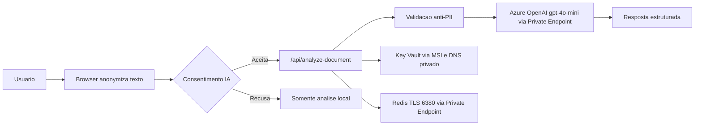

# Segurança e LGPD

**Versão:** 1.35.2
**Atualizado:** 2026-05-28

## Baseline de Segurança

- HTTPS-only com HSTS (`strict-transport-security`)
- CSP habilitado com allowlist explícita
- `x-frame-options: DENY`
- `x-content-type-options: nosniff`
- `referrer-policy` e `permissions-policy` habilitados
- Rate limit para proteção contra abuso no runtime do servidor
- Ingresso do App Service restrito às faixas de IP da edge da Cloudflare (deny por padrão)
- Azure OpenAI em modo privado (`publicNetworkAccess=Disabled`)
- Key Vault em modo privado por padrão (`public_network_access_enabled=false`)
- Redis em modo privado (`publicNetworkAccess=Disabled`, TLS 1.2)

Executar verificação de baseline:

```bash
bash scripts/security_headers_check.sh
```

## Posicionamento LGPD

- Base legal para análise por IA: consentimento (Art. 7º, I)
- Revogação de consentimento: disponível em UI permanente (Art. 8º, §5)
- Direitos do titular (Art. 18): documentados no modal de consentimento
- Análise padrão é local; análise por IA envia apenas texto anonimizado
- Servidor rejeita payloads com PII evidente (HTTP 422)
- Meta de retenção para saída da análise por IA: zero retenção de prompt/conteúdo

> Checklist auditável recorrente: [LGPD-COMPLIANCE.md](LGPD-COMPLIANCE.md)



## Notas de Segurança de Rede

- Domínio oficial (`nossodireito.fabiotreze.com`) permanece público para os usuários.
- Hostname direto do App Service (`*.azurewebsites.net`) deve retornar 403.
- Tráfego App Service -> OpenAI, Key Vault e Redis ocorre por VNet + Private Endpoint + Private DNS.
- Segredo `redis-primary-key` por padrão não é atualizado pelo Terraform em runners externos à VNet.

## Fluxo do DPO

- Canal de contato: `dpo@fabiotreze.com`
- SLA recomendado de resposta: até 15 dias corridos
- Checklist de entrada:
  1. Solicitação recebida e registrada
  2. Identidade e escopo da solicitação confirmados
  3. Mapa de dados revisado (dados locais no navegador vs telemetria do servidor)
  4. Resposta enviada com resumo das ações

## Controles de Conformidade

- Checagens de CI para testes e qualidade de conteúdo
- Workflows de segurança do GitHub (CodeQL, gitleaks)
- Validação do Terraform + checagens de policy no pipeline
- Telemetria do App Insights configurada com controles que preservam privacidade
