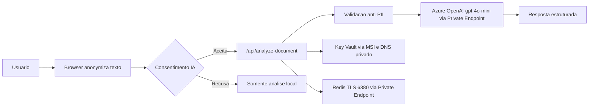

# Segurança e LGPD

**Versão:** 1.43.42
**Atualizado:** 2026-06-05

## Baseline de Segurança

- HTTPS-only com HSTS (`strict-transport-security`)
- CSP habilitado com allowlist explícita
- `x-frame-options: DENY`
- `x-content-type-options: nosniff`
- `referrer-policy` e `permissions-policy` habilitados
- Rate limit para proteção contra abuso no runtime do servidor
- Ingresso do App Service restrito às faixas de IP da edge da Cloudflare (deny por padrão)
- Azure OpenAI em modo privado (`publicNetworkAccess=Disabled`)
- Key Vault em modo privado por padrão (`public_network_access_enabled=false`)
- Redis em modo privado (`publicNetworkAccess=Disabled`, TLS 1.2)

Executar verificação de baseline:

```bash
bash scripts/security_headers_check.sh
```

## Posicionamento LGPD

- Base legal para análise por IA: consentimento (Art. 7º, I)
- Revogação de consentimento: disponível em UI permanente (Art. 8º, §5)
- Direitos do titular (Art. 18): documentados no modal de consentimento
- Análise padrão é local; análise por IA envia apenas texto anonimizado
- Servidor rejeita payloads com PII evidente (HTTP 422)
- Meta de retenção para saída da análise por IA: zero retenção de prompt/conteúdo

> Checklist auditável recorrente: [LGPD-COMPLIANCE.md](LGPD-COMPLIANCE.md)



## Notas de Segurança de Rede

- Domínio oficial (`nossodireito.fabiotreze.com`) permanece público para os usuários.
- Hostname direto do App Service (`*.azurewebsites.net`) deve retornar 403.
- Tráfego App Service -> OpenAI, Key Vault e Redis ocorre por VNet + Private Endpoint + Private DNS.
- Segredo `redis-primary-key` por padrão não é atualizado pelo Terraform em runners externos à VNet.

## Fluxo do DPO

- Canal de contato: `dpo@fabiotreze.com`
- SLA recomendado de resposta: até 15 dias corridos
- Checklist de entrada:
  1. Solicitação recebida e registrada
  2. Identidade e escopo da solicitação confirmados
  3. Mapa de dados revisado (dados locais no navegador vs telemetria do servidor)
  4. Resposta enviada com resumo das ações

## Controles de Conformidade

- Checagens de CI para testes e qualidade de conteúdo
- Workflows de segurança do GitHub (CodeQL, gitleaks)
- Validação do Terraform + checagens de policy no pipeline
- **Sem telemetria de aplicação** — nenhum SDK de APM/observabilidade está instalado no servidor (decisão de 2026-06-05). Métricas operacionais usam Azure Monitor platform metrics (App Service) e http logs do App Service (3d).

## Marco Civil da Internet (Lei 12.965/2014)

- **Art. 15:** O serviço é educacional e não opera com fins econômicos, não se enquadrando na hipótese do Art. 15 do Marco Civil. Ainda assim, mantemos para troubleshooting:
  - **App Service http logs** (filesystem, retenção de 3 dias) com IPs anonimizados pela edge da Cloudflare.
  - **Azure Monitor platform metrics** do plano (request count, response time, CPU/memory) — métricas agregadas sem PII.
- **Art. 7º, VII:** Não fornecimento a terceiros de registros de conexão e
  acesso sem consentimento livre, expresso e informado ou determinação judicial.

## Referências normativas ANPD

| Resolução | Assunto | Impacto no portal |
|-----------|---------|-------------------|
| Res. CD/ANPD nº 2/2022 | Agentes de tratamento de pequeno porte | Portal NÃO se enquadra (dados sensíveis, IA, idosos, crianças) |
| Res. CD/ANPD nº 4/2023 | RIPD | [docs/RIPD.md](RIPD.md) |
| Res. CD/ANPD nº 15/2024 | Comunicação de incidentes | [RUNBOOK-INCIDENTE-LGPD.md](RUNBOOK-INCIDENTE-LGPD.md) |
| Res. CD/ANPD nº 18/2024 | Encarregado (DPO) | [docs/ENCARREGADO.md](ENCARREGADO.md) |

## Fluxo do laudo / PDF do titular — segurança fim a fim

Esta seção descreve o que acontece, em ordem, com o arquivo (PDF, imagem
ou texto) que o titular envia ao formulário de análise por IA. **O
binário do arquivo nunca é enviado ao servidor.**

```mermaid
flowchart TD
    U[Titular seleciona PDF/imagem] --> B1[Browser: PDF.js / OCR local<br>extrai texto na memória da aba]
    B1 --> B2[shared/anonymizer.js<br>remove CPF, RG, nome, e-mail,<br>telefone, endereço, datas]
    B2 --> C{Consentimento<br>específico dado?}
    C -->|Não| STOP[Envio bloqueado]
    C -->|Sim| TLS[POST JSON via TLS 1.2+<br>HSTS, certificado gerenciado<br>{ text: 'texto anonimizado' }]
    TLS --> S[App Service Linux<br>brazilsouth, Managed Identity]
    S --> RE[lib/ai-analyze.js<br>re-anonimização defense-in-depth]
    RE --> V{PII residual<br>detectada?}
    V -->|Sim| R422[HTTP 422 — rejeita,<br>nada chega à IA]
    V -->|Não| PE[Azure OpenAI brazilsouth<br>Private Endpoint<br>publicNetworkAccess=Disabled]
    PE --> NR[Sem retenção de prompt/resposta<br>configuração Azure OpenAI]
    NR --> S
    S --> RESP[Resposta estruturada<br>cids, dates, paragraphs]
    RESP --> B3[Browser exibe resultado]
    B3 --> CLOSE[Usuário fecha aba<br>→ texto e PDF apagados<br>da memória]
```

### Onde mora o dado em cada etapa

| Etapa | Local | Persistência | Criptografia |
|-------|-------|--------------|--------------|
| 1. PDF selecionado | RAM da aba do navegador | **Volátil** — só enquanto a aba está aberta | N/A (local) |
| 2. Texto extraído (PDF.js) | RAM da aba | Volátil | N/A (local) |
| 3. Texto anonimizado | RAM da aba | Volátil | N/A (local) |
| 4. Envio HTTP | Internet → Azure brazilsouth | Em trânsito | **TLS 1.2+ obrigatório, HSTS, cert gerenciado Azure** |
| 5. Recebimento no App Service | Memória do processo Node.js | Volátil (não grava em disco) | **TLS terminado em front-end Azure** |
| 6. Validação de PII residual | Memória do processo | Volátil | N/A (em memória) |
| 7. Chamada Azure OpenAI | Rede privada Azure (Private Endpoint) | Volátil | **TLS interno Azure backbone + isolamento de VNet** |
| 8. Processamento na IA | Azure OpenAI brazilsouth | **Sem retenção** (config oficial Azure) | TLS interno + criptografia em repouso AES-256 (mesmo durante processamento) |
| 9. Resposta para o servidor | Rede privada Azure | Volátil | TLS interno |
| 10. Resposta ao navegador | Internet → cliente | Em trânsito | **TLS 1.2+ + HSTS** |
| 11. Exibição ao usuário | RAM da aba | Volátil | N/A (local) |
| 12. Aba fechada | — | **Apagado da RAM** | — |

### Garantias técnicas verificáveis

- **Sem upload de binário:** o endpoint `/api/analyze-document` aceita
  apenas `Content-Type: application/json` (HTTP 415 caso contrário —
  [lib/ai-analyze.js](../lib/ai-analyze.js)). Multipart/form-data,
  octet-stream e qualquer outro tipo são bloqueados na entrada.
- **Sem disco no servidor:** o handler processa em memória e responde,
  sem `fs.write`, sem fila, sem banco de dados.
- **Sem logs com conteúdo:** o servidor não registra texto enviado nem resposta da IA. Não há SDK de telemetria de aplicação; somente os http logs do App Service (3d) capturam linha de acesso (método + path + status).
- **Anti-vazamento por IA:** Azure OpenAI no portal está com **data
  retention zero** (sem retenção de prompts para abuse monitoring),
  configuração aprovada pela MS quando solicitada.
- **Isolamento de rede:** Azure OpenAI e Key Vault com Private Endpoint,
  `publicNetworkAccess=Disabled`. Tráfego não sai da VNet Azure.
- **Identidade sem segredo:** App Service acessa Azure OpenAI via Managed
  Identity (sem API key armazenada em variável de ambiente ou código).
- **TLS reforçado:** `Strict-Transport-Security: max-age=63072000;
  includeSubDomains; preload`, TLS 1.2+ apenas, cert ECDSA gerenciado
  pelo Azure App Service.

### O que o servidor NUNCA recebe

- PDF binário ou qualquer arquivo
- CPF, RG, nome, e-mail, telefone, endereço (anonimizados no browser
  e re-filtrados no servidor)
- Nome do arquivo original
- Tamanho original do arquivo
- Geolocalização do usuário
- IP real

### Referências de implementação

- Anonimização cliente: `shared/anonymizer.js`
- Handler servidor: [lib/ai-analyze.js](../lib/ai-analyze.js)
- Headers de segurança: [lib/security-headers.js](../lib/security-headers.js)
- Análise de risco completa: [docs/RIPD.md](RIPD.md)

