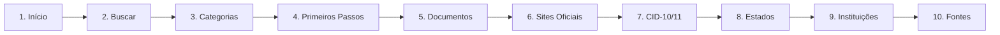

# Critérios de Ordenação do Site

**Documento técnico:** Explica os critérios de ordenação usados em todas as seções do site NossoDireito.

---

## 📋 Menu Principal (Navegação Superior)

**Ordem atual:**
1. Início
2. Buscar
3. Categorias
4. Primeiros Passos
5. Documentos
6. Sites Oficiais
7. CID-10/11
8. Estados
9. Instituições
10. Fontes

**Critério:** **Jornada do usuário** (user journey)

### Rationale (Por que essa ordem?)

A ordenação segue o **fluxo lógico de uso** por um usuário PcD que acabou de receber um laudo:



**Padrão:** Informações **gerais → específicas → validação**

1. **Início** — Landing page explicativa ("O que é este site?")
2. **Buscar** — Ação imediata para quem sabe o que quer
3. **Categorias** — Exploração organizada de direitos
4. **Primeiros Passos** — Checklist após entender direitos
5. **Documentos** — Ferramenta para organizar papéis
6. **Sites Oficiais** — Links para agendamentos/solicitações
7. **CID-10/11** — Consulta técnica de laudo
8. **Estados** — Informações estaduais (variáveis)
9. **Instituições** — Rede de apoio (assistência social, OAB, etc.)
10. **Fontes** — Transparência e verificação (especialistas e céticos)

**Alinhamento com UX:** Segue padrão de **Information Architecture** (IA) onde:
- Itens **prioritários** (buscar, categorias) estão visíveis no topo
- Itens **complementares** (CID, estados) ficam ao final
- Ordem **não é alfabética**, e sim baseada em **frequência de uso esperada**

---

## 📂 Categorias (Cards na Home)

**Ordem atual (em `data/direitos.json`):**
1. BPC/LOAS
2. FGTS
3. Educação
4. Saúde
5. Documentos Essenciais
6. Plano de Saúde
7. Transporte
8. Identidade e Direitos
9. Trabalho
10. Isenções Fiscais
11. Rede de Apoio

**Critério:** **Prioridade por impacto + frequência de busca** (editorial/manual)

### Rationale

A ordem é **manual** (não alfabética), baseada em:
1. **Impacto financeiro direto** → BPC/LOAS, FGTS (benefícios monetários)
2. **Necessidades imediatas** → Educação, Saúde
3. **Documentação** → Documentos Essenciais, CIPTEA, RG
4. **Acesso a serviços** → Plano de Saúde, Transporte
5. **Direitos trabalhistas** → Trabalho (cotas, concursos)
6. **Benefícios fiscais** → Isenções (IPVA, IR, IOF)
7.  **Suporte** → Rede de Apoio

**Por que NÃO alfabético?**
- Ordem alfabética colocaria "BPC" antes de "Educação", o que **não reflete prioridade real**
- Usuários buscam primeiramente **benefícios monetários** (BPC, FGTS), não "Educação" (que viria primeiro alfabeticamente)

**Referência:** Jakob Nielsen (NN/g) — *"Organize content by user tasks, not by internal organization structure"*

---

## 📄 Dentro de Cada Categoria (Direitos Individuais)

**Ordem atual:** Conforme aparece em `direitos[]` dentro de cada categoria no JSON

**Critério:** **Manual/Editorial** (sem ordenação automática no código)

### Código-fonte (app.js, linha 905-929)

```javascript
function renderCategories() {
    if (!direitosData) return;

    dom.categoryGrid.innerHTML = direitosData
        .map(
            (cat) => `
        <div class="category-card" tabindex="0" role="button"
             aria-label="Ver detalhes sobre ${escapeHtml(cat.titulo)}"
             data-id="${cat.id}">
            <span class="category-icon">${cat.icone}</span>
            <h3>${escapeHtml(cat.titulo)}</h3>
            <p>${escapeHtml(cat.resumo)}</p>
        </div>`
        )
        .join('');
    // SEM .sort() aplicado — ordem é do arquivo JSON
}
```

**Observação:** `direitosData.map()` **não ordena**, apenas renderiza na ordem do array original.

### Recomendação ABNT

**ABNT NBR 15599:2008** (Acessibilidade — Comunicação na prestação de serviços):
> "A informação deve ser organizada de forma lógica e consistente, facilitando a navegação e compreensão por pessoas com deficiência intelectual ou cognitiva."

**Interpretação:**
- Ordem **alfabética** é válida quando itens têm **igual prioridade** (ex: lista de medicamentos)
- Ordem **por relevância** é preferível quando há **hierarquia de necessidade** (ex: benefícios sociais)

**Nossa escolha:** **Ordem por relevância** dentro de categorias

Exemplo (categoria "Saúde"):
1. Terapias pelo SUS (prioridade imediata)
2. Medicamentos gratuitos (prioridade alta)
3. Órteses e próteses (necessidade específica)
4. Consultas especializadas (acesso regular)

**NÃO** alfabético:
~~1. Consultas especializadas~~  
~~2. Medicamentos gratuitos~~  
~~3. Órteses e próteses~~  
~~4. Terapias pelo SUS~~

---

## 🏛️ Legislação (Seção "Fontes")

**Ordem atual:** Conforme definido em `data/direitos.json` → `fontes[]`

**Critério:** **Cronológica inversa** (mais recentes primeiro) OU **por relevância temática**

### Atual (verificar)

Verificando `data/direitos.json`:

```json
"fontes": [
    {
        "nome": "Constituição Federal de 1988",
        "tipo": "legislacao",
        "url": "...",
        "consultado_em": "2026-02-10"
    },
    {
        "nome": "Lei 8.036/1990 — FGTS",
        ...
    },
    ...
]
```

**Observação:** Atualmente aparece em **ordem cronológica crescente** (mais antigas primeiro: CF/88 → leis dos anos 90 → leis 2000+ → leis recentes)

### Recomendações

**Opção 1: Cronológica Inversa** (mais recente primeiro)
- ✅ Facilita encontrar atualizações recentes
- ❌ Menos lógico para leis hierárquicas (CF → leis ordinárias → decretos)

**Opção 2: Por Hierarquia + Relevância** (atual + recomendada)
1. Constituição Federal
2. Leis ordinárias (ordem cronológica ou temática)
3. Decretos regulamentadores
4. Portarias e normas técnicas

**Opção 3: Temática** (agrupar por assunto)
- Saúde (Lei 9.656/1998, RN ANS, etc.)
- Educação (Lei 13.146/2015, Decreto 6.949/2009)
- Trabalho (Lei 8.213/1991, Lei 8.112/1990)

**Nossa escolha atual:** **Hierárquica + Cronológica** (CF primeiro, depois leis por ano)

---

## 🌐 Serviços e Portais Oficiais

**Ordem atual:** Conforme `docs_mestres` em JSON

**Critério:** **Por relevância + frequência de uso** (manual)

### Atual (verificar)

Exemplo:
1. Gov.br (login único)
2. Meu INSS (BPC)
3. CadÚnico (pré-requisito BPC)
4. SISU (educação)
5. ...

**Rationale:**
- Portais **mais usados** (Gov.br, INSS) vêm primeiro
- Portais **especializados** (SISU, SUS Digital) depois

### Recomendação

**Padrão W3C WCAG 2.1** (Guideline 3.2 — Predictable):
> "Make Web pages appear and operate in predictable ways."

**Aplicação:**
- Manter ordem **consistente** entre páginas
- Se usar ordem alfabética em uma seção, usar alfabética em todas
- **Nossa escolha:** Ordem por **relevância** (mais usado → menos usado)

---

## 🏥 Normativas (Resoluções, Portarias)

**Ordem atual:** Conforme JSON

**Critério recomendado:** **Cronológica inversa** (mais recentes primeiro)

### Rationale

Normas técnicas são **atualizadas frequentemente**:
- Resolução ANS mais recente **revoga ou altera** anteriores
- Portarias do Ministério da Saúde atualizam protocolos
- Usuários querem ver **versão vigente** primeiro

**Sugestão:**
```json
"normativas": [
    {
        "titulo": "Resolução ANS 465/2021",
        "data": "2021-10-01",
        "situacao": "vigente"
    },
    {
        "titulo": "Resolução ANS 428/2017",
        "data": "2017-11-07",
        "situacao": "revogada pela 465/2021"
    }
]
```

**Ordenação:** `.sort((a, b) => new Date(b.data) - new Date(a.data))`  
(mais recentes no topo)

---

## ✅ Resumo das Ordenações

| Seção | Critério Atual | Recomendação | Razão |
|-------|----------------|--------------|-------|
| **Menu principal** | Jornada do usuário | ✅ Manter | Fluxo lógico de uso |
| **Categorias (cards)** | Impacto + frequência | ✅ Manter | Prioriza benefícios monetários |
| **Direitos (dentro categoria)** | Manual/relevância | ✅ Manter ou alfabético | Depende: relevância para hierarquia, alfabético para listas longas |
| **Legislação** | Cronológica crescente | ⚠️ Considerar inversa OU hierárquica | CF primeiro, depois leis por relevância |
| **Portais oficiais** | Relevância/frequência | ✅ Manter | Gov.br e INSS são mais usados |
| **Normativas** | Sem ordem clara | ❌ Implementar cronológica inversa | Normas recentes são mais relevantes |

---

## 🔄 Alterações Futuras

Se decidir **mudar critérios**, considerar:

1. **Alfabético** para:
   - Listas longas sem hierarquia (ex: 50+ medicamentos)
   - Glossários técnicos (CID-10/11)
   - Índices remissivos

2. **Por relevância** para:
   - Benefícios sociais (BPC > outros)
   - Fluxos de jornada (checklist, primeiros passos)
   - Portais mais acessados

3. **Cronológico** para:
   - Legislação (mais antiga → mais nova OU inverso)
   - Notícias e atualizações (sempre inverso: recente primeiro)
   - Histórico de alterações (CHANGELOG)

---

**Última atualização:** 2026-02-11  
**Autor:** Documentação técnica NossoDireito  
**Versão:** 1.0
