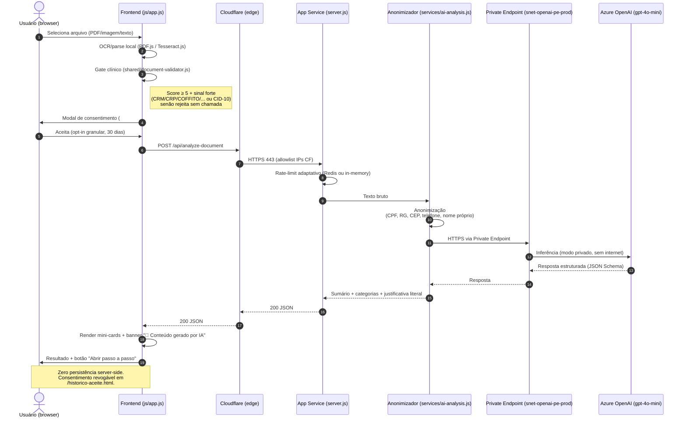

# Fluxo de IA Atual

**Versão:** 1.43.48
**Atualizado:** 2026-06-07

Sequência canônica de uma análise de documento via IA, com consentimento explícito (LGPD Art. 7º, I) e anonimização antes de qualquer chamada ao provedor externo.

## Garantias

- **Anonimização obrigatória** antes do envio ao OpenAI (LGPD Art. 6º).
- **Private Endpoint** — tráfego ao Azure OpenAI não sai da VNet.
- **Circuit breaker** em `lib/ai-analyze.js` (timeout 8s, 1 retry).
- **Banner persistente** "🤖 Conteúdo gerado por IA (Azure OpenAI gpt-4o-mini, Brasil Sul)" no resultado (MS Learn AI Principles: Transparency + Validation).
- **Revogação** em `/historico-aceite.html` (apaga `nd_ai_consent_v2` do localStorage).

## Referências

- Código: [services/ai-analysis.js](../../services/ai-analysis.js), [lib/ai-analyze.js](../../lib/ai-analyze.js), [shared/document-validator.js](../../shared/document-validator.js)
- Infra: [terraform/ai-openai.tf](../../terraform/ai-openai.tf), [terraform/openai-private-network.tf](../../terraform/openai-private-network.tf)
- Política: [AI-PRINCIPLES.md](../AI-PRINCIPLES.md), [RIPD.md](../RIPD.md), [REVISAO-HUMANA-IA.md](../REVISAO-HUMANA-IA.md)
