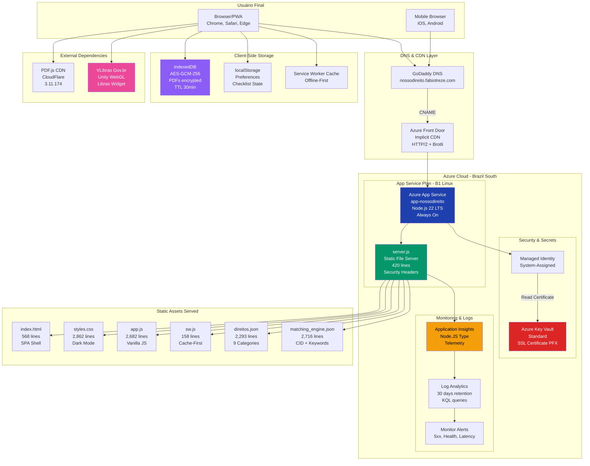
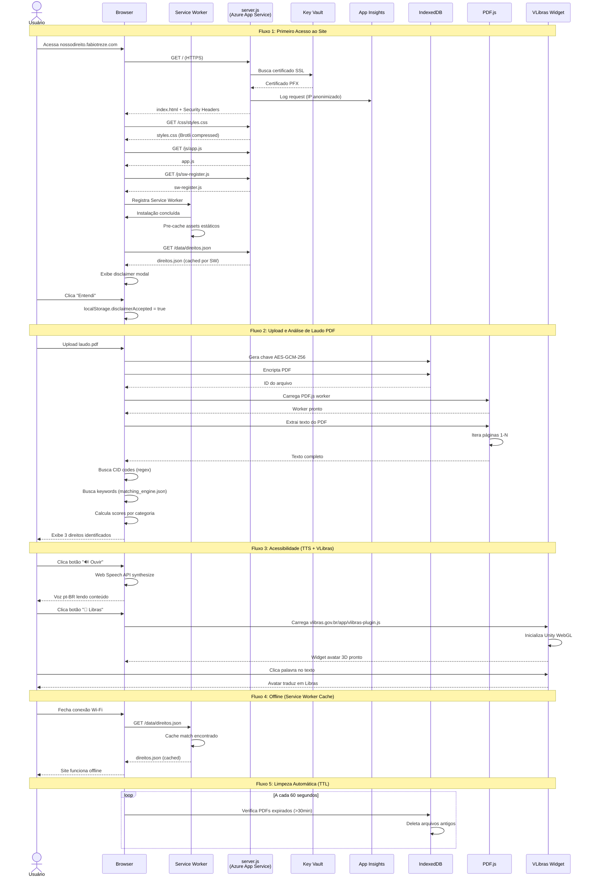
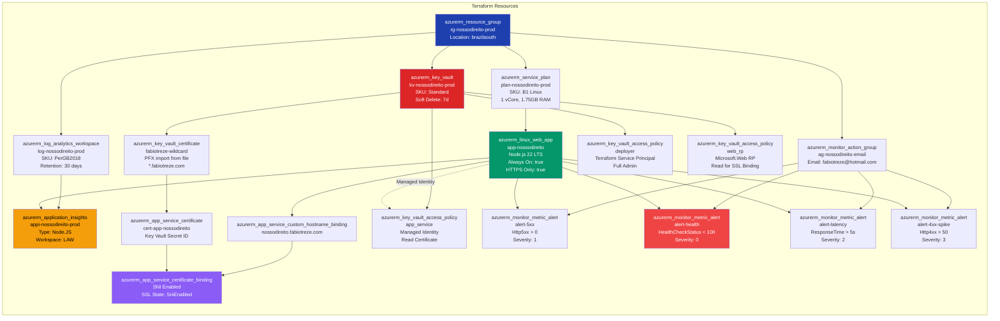
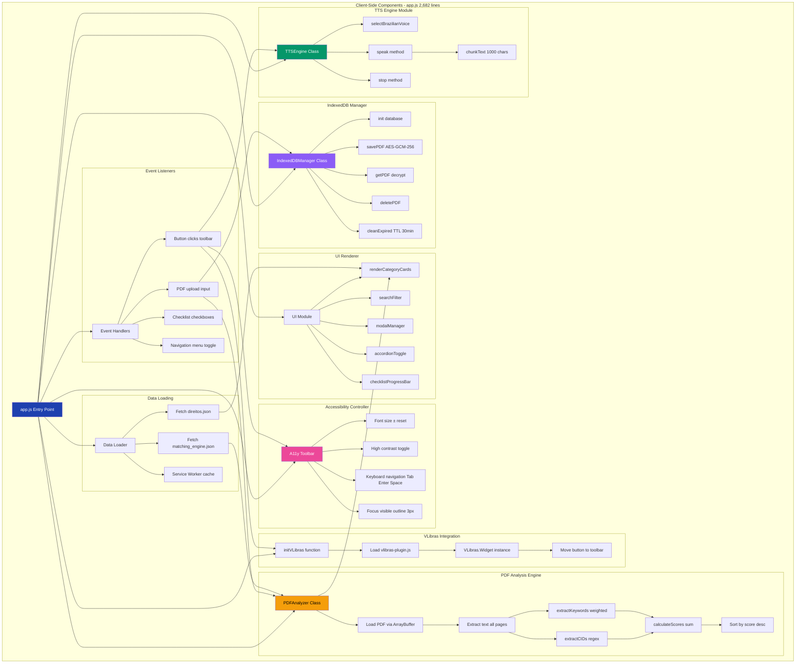
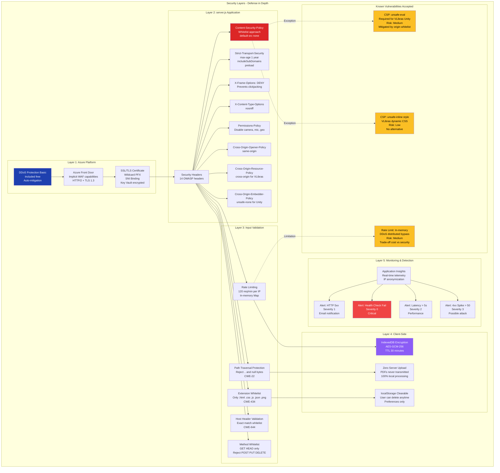

# NossoDireito — Diagramas Completos do Sistema V1

**Versão:** 1.2.0  
**Data:** Fevereiro 2026  
**Tipo:** Documentação Visual da Arquitetura  

---

## Índice

1. [Visão Geral](#1-visão-geral)
2. [Diagrama 1: Arquitetura Geral](#2-diagrama-1-arquitetura-geral)
3. [Diagrama 2: Fluxo de Dados - Interação do Usuário](#3-diagrama-2-fluxo-de-dados---interação-do-usuário)
4. [Diagrama 3: Infraestrutura Terraform (Azure)](#4-diagrama-3-infraestrutura-terraform-azure)
5. [Diagrama 4: Módulos Client-Side (JavaScript)](#5-diagrama-4-módulos-client-side-javascript)
6. [Diagrama 5: Camadas de Segurança](#6-diagrama-5-camadas-de-segurança)
7. [Diagrama 6: CI/CD Pipeline](#7-diagrama-6-cicd-pipeline)
8. [Diagrama 7: Conformidade LGPD](#8-diagrama-7-conformidade-lgpd)
9. [Legenda de Cores](#9-legenda-de-cores)

---

## 1. Visão Geral

Este documento apresenta **7 diagramas Mermaid** que cobrem toda a arquitetura do sistema NossoDireito V1:

- **Infraestrutura** (Azure, Terraform, GoDaddy)
- **Código** (server.js, app.js, módulos client-side)
- **Fluxos de dados** (usuário → servidor → browser)
- **Segurança** (EASM, OWASP, CSP, rate limiting)
- **CI/CD** (GitHub Actions, deploy, quality gate)
- **Conformidade** (LGPD Art. 4º, zero-data architecture)

**Ferramentas de Visualização:**
- GitHub Markdown (renderiza Mermaid nativamente)
- VS Code + Markdown Preview Mermaid Extension
- [Mermaid Live Editor](https://mermaid.live) para edição online

---

## 2. Diagrama 1: Arquitetura Geral

**Propósito:** Visão de alto nível mostrando todos os componentes do sistema, desde o usuário final até Azure Cloud, passando por DNS, CDN, App Service, Key Vault, monitoring e client-side storage.



**Componentes Principais:**
- **GoDaddy DNS**: CNAME `nossodireito.fabiotreze.com` → `app-nossodireito.azurewebsites.net`
- **Azure Front Door**: CDN implícito (HTTP/2, Brotli compression)
- **App Service B1**: Hospeda Node.js 22 LTS rodando `server.js`
- **Key Vault**: Armazena certificado SSL PFX (wildcard `*.fabiotreze.com`)
- **Application Insights**: Telemetria (page views, latência, erros)
- **IndexedDB**: Armazenamento local de PDFs com AES-GCM-256 (TTL 30 min)
- **VLibras**: Widget gov.br para tradução Libras (Unity WebGL)

---

## 3. Diagrama 2: Fluxo de Dados - Interação do Usuário

**Propósito:** Sequence diagram mostrando 5 fluxos principais de interação entre usuário, browser, servidor e serviços externos.



**Fluxos Detalhados:**

1. **Primeiro Acesso**: Browser faz 6 requests (HTML, CSS, JS, SW, JSON), Service Worker pre-cache todos assets
2. **Análise PDF**: Upload → Encrypt AES-GCM-256 → IndexedDB → PDF.js extrai texto → Regex matching CID + keywords → Score ranking
3. **Acessibilidade**: TTS usa Web Speech API pt-BR, VLibras carrega Unity WebGL widget gov.br
4. **Offline-First**: Service Worker serve assets cached quando sem internet
5. **TTL Auto-cleanup**: Loop limpa PDFs >30 min a cada 60s

---

## 4. Diagrama 3: Infraestrutura Terraform (Azure)

**Propósito:** Todos os recursos Azure provisionados via Terraform IaC (`main.tf` 370 linhas).



**Recursos Terraform (17 total):**

| Recurso | Tipo | Propósito |
|---------|------|-----------|
| `rg-nossodireito-prod` | Resource Group | Container de todos recursos |
| `plan-nossodireito-prod` | Service Plan | B1 Linux (1 vCore, 1.75GB) |
| `app-nossodireito` | Web App | Hospeda Node.js 22 LTS |
| `kv-nossodireito-prod` | Key Vault | Armazena certificado PFX |
| `fabiotreze-wildcard` | Certificate | PFX importado (*.fabiotreze.com) |
| `cert-app-nossodireito` | App Service Cert | Referencia KV secret |
| `nossodireito.fabiotreze.com` | Custom Hostname | CNAME binding |
| SSL Binding | Certificate Binding | SNI Enabled SSL |
| `log-nossodireito-prod` | Log Analytics | 30 dias retenção |
| `appi-nossodireito-prod` | App Insights | Telemetria Node.JS |
| `ag-nossodireito-email` | Action Group | Email alerts |
| 4x Metric Alerts | Monitor Alerts | 5xx, health, latency, 4xx |
| 3x Access Policies | Key Vault Policies | Deployer, App, Web RP |

**Comandos Terraform:**
```bash
terraform init          # Download providers
terraform validate      # Syntax check
terraform plan          # Preview changes
terraform apply         # Provision infra
terraform output        # Show outputs (URL, keys)
```

---

## 5. Diagrama 4: Módulos Client-Side (JavaScript)

**Propósito:** Estrutura interna do `app.js` (2.682 linhas) dividido em 8 módulos funcionais.



**Módulos JavaScript:**

1. **TTS Engine**: Web Speech API, voz pt-BR, chunking 1000 chars
2. **VLibras**: Unity WebGL widget gov.br, avatar Icaro/Hosana
3. **PDF Analyzer**: PDF.js extraction, CID regex, keyword weighting, score ranking
4. **IndexedDB**: AES-GCM-256 encryption, TTL 30 min, auto-cleanup 60s
5. **UI Renderer**: Dynamic cards, accordion, modal, search filter
6. **A11y Toolbar**: Font ±, high contrast, keyboard nav, focus visible
7. **Data Loader**: Fetch JSON, Service Worker cache strategy
8. **Event Handlers**: Upload, buttons, forms, navigation

---

## 6. Diagrama 5: Camadas de Segurança

**Propósito:** Defense in depth com 5 camadas de segurança (Platform → Application → Input → Client → Monitoring).



**Mitigação de Vulnerabilidades (CWE):**

| CWE | Vulnerabilidade | Mitigação |
|-----|-----------------|-----------|
| CWE-22 | Path Traversal | Reject `..`, normalize paths, `startsWith(ROOT)` |
| CWE-158 | Null Byte Injection | Reject `\0` in URLs |
| CWE-116 | Control Characters | Reject `[\x00-\x1f\x7f]` |
| CWE-400 | Resource Exhaustion | Max URL 2048, timeout 30s |
| CWE-434 | Unrestricted Upload | Extension whitelist only |
| CWE-644 | Host Header Poisoning | Exact match whitelist |
| CWE-770 | Allocation w/o Limits | Rate limit 120 req/min |
| CWE-200 | Information Exposure | Suppress `X-Powered-By`, block `/terraform` |
| CWE-693 | Protection Failure | 14 security headers (CSP, HSTS, etc.) |

**Vulnerabilidades Aceitas:**
- `unsafe-eval` em CSP: Necessário para VLibras Unity WebAssembly (trade-off funcionalidade vs. segurança)
- `unsafe-inline` em `style-src`: VLibras injeta CSS dinamicamente (sem alternativa)
- Rate limiting in-memory: DDoS distribuído não mitigado (trade-off custo Redis vs. simplicidade)

---

## 7. Diagrama 6: CI/CD Pipeline

**Propósito:** Workflow GitHub Actions para quality gate (PR validation) e deployment (push to main).

```mermaid
graph LR
    subgraph "GitHub Repository"
        Code[Source Code<br/>HTML, CSS, JS, JSON]
        TF[Terraform IaC<br/>main.tf, variables.tf]
        Scripts[Python Scripts<br/>validate_sources.py<br/>bump_version.py]
        Workflows[GitHub Actions<br/>deploy.yml<br/>quality-gate.yml]
    end
    
    subgraph "CI Pipeline - Quality Gate"
        PR[Pull Request Trigger]
        Validate[Run validate_sources.py<br/>Check .gov.br URLs]
        Lint[JSON syntax check<br/>jq empty *.json]
        Audit[npm audit<br/>Security vulnerabilities]
        Tests[Unit tests<br/>Not implemented yet]
    end
    
    subgraph "CD Pipeline - Deployment"
        Push[Push to main branch]
        Checkout[Checkout code<br/>actions/checkout@v4]
        NodeSetup[Setup Node.js 22<br/>actions/setup-node@v4]
        InstallDeps[npm ci<br/>Install applicationinsights]
        AzLogin[Azure Login<br/>Service Principal JSON]
        Deploy[Deploy App Service<br/>azure/webapps-deploy@v2]
        HealthCheck[Verify /health<br/>curl -f https://nossodireito...]
    end
    
    subgraph "Terraform Workflow Manual"
        TF_Init[terraform init<br/>Download azurerm provider]
        TF_Validate[terraform validate<br/>Syntax check]
        TF_Plan[terraform plan<br/>Dry-run preview changes]
        TF_Apply[terraform apply<br/>Provision Azure resources]
        TF_Output[terraform output<br/>App URL, Insights key]
    end
    
    subgraph "Azure App Service"
        AppSvc[app-nossodireito<br/>Running on B1 Linux]
        Kudu[Kudu SCM<br/>Deployment logs<br/>SSH console]
    end
    
    Code --> PR
    Code --> Push
    
    PR --> Validate
    Validate --> Lint
    Lint --> Audit
    Audit --> Tests
    
    Tests -.->|Pass| Merge[Merge to main]
    Merge --> Push
    
    Push --> Checkout
    Checkout --> NodeSetup
    NodeSetup --> InstallDeps
    InstallDeps --> AzLogin
    AzLogin --> Deploy
    Deploy --> AppSvc
    AppSvc --> HealthCheck
    
    HealthCheck -.->|200 OK| Success[Deployment Success]
    HealthCheck -.->|Non-200| Rollback[Manual Rollback]
    
    TF --> TF_Init
    TF_Init --> TF_Validate
    TF_Validate --> TF_Plan
    TF_Plan --> TF_Apply
    TF_Apply --> AppSvc
    TF_Apply --> TF_Output
    
    AppSvc --> Kudu
    
    style Push fill:#1e40af,color:#fff
    style Deploy fill:#059669,color:#fff
    style TF_Apply fill:#f59e0b,color:#000
    style Success fill:#16a34a,color:#fff
    style Rollback fill:#dc2626,color:#fff
```



**Workflows GitHub Actions:**

1. **quality-gate.yml** (PR trigger):
   - `validate_sources.py`: Valida URLs .gov.br em `direitos.json`
   - `jq empty`: Verifica sintaxe JSON
   - `npm audit`: Scan vulnerabilidades de segurança
   - Unit tests: Não implementado (TODO)

2. **deploy.yml** (Push to main):
   - Checkout código
   - Setup Node.js 22
   - `npm ci` instala applicationinsights
   - Azure login com Service Principal
   - Deploy para App Service via `azure/webapps-deploy@v2`
   - Health check `/health` (200 OK = success)

3. **Terraform (Manual)**:
   - `terraform init`: Baixa provider azurerm
   - `terraform validate`: Syntax check
   - `terraform plan`: Preview mudanças
   - `terraform apply`: Provisiona infra
   - `terraform output`: Exibe URLs/keys

---

## 8. Diagrama 7: Conformidade LGPD

**Propósito:** Arquitetura zero-data collection que garante conformidade LGPD Art. 4º, I.

```mermaid
graph TB
    subgraph "LGPD Compliance Architecture"
        
        subgraph "Data Processing Principle"
            Art4[LGPD Art. 4º, I<br/>"Não se aplica a dados<br/>que não são objeto<br/>de tratamento"]
            ZeroCollection[Zero Data Collection<br/>Nenhum dado pessoal<br/>chega ao servidor]
        end
        
        subgraph "Server-Side - Azure App Service"
            Server[server.js<br/>Static File Server]
            NoPost[Reject POST/PUT/DELETE<br/>Somente GET/HEAD]
            NoCookies[Zero Cookies<br/>Sem tracking]
            NoForm[form-action: none<br/>CSP header]
            NoPersist[Zero Persistência<br/>Não grava uploads]
        end
        
        subgraph "Client-Side - Browser Storage"
            IndexedDB[IndexedDB<br/>nossoDireitoDB]
            PDFs[PDFs: AES-GCM-256<br/>TTL 30 minutos<br/>Auto-delete]
            LocalStorage[localStorage<br/>Preferences Only]
            Prefs[disclaimerAccepted: boolean<br/>fontSize: number<br/>highContrast: boolean<br/>checklist progress]
            ClearBtn[Botão "Apagar Dados"<br/>User-controlled deletion]
        end
        
        subgraph "Telemetry - Application Insights"
            AI[Azure App Insights<br/>Microsoft Analytics]
            
            Collected[Dados Coletados:<br/>✅ Page views URL path<br/>✅ IP anonimizado últimos 2 octets<br/>✅ Geolocalização País/Estado<br/>✅ User-Agent Browser/OS<br/>✅ Response time ms<br/>✅ HTTP status codes]
            
            NotCollected[Dados NÃO Coletados:<br/>❌ Conteúdo de PDFs<br/>❌ Texto de buscas<br/>❌ Estado de checkboxes<br/>❌ Nomes, CPFs, RGs<br/>❌ Cookies/fingerprinting<br/>❌ Query params sensíveis]
            
            LegalBasis[Base Legal:<br/>Legítimo Interesse Art. 10<br/>Segurança cibernética<br/>Prevenção de fraude]
        end
        
        subgraph "Transparency - Disclaimer Modal"
            Modal[Modal Obrigatório<br/>Primeiro Acesso]
            DisclaimerText["🔒 Privacidade LGPD:<br/>- Zero coleta de dados pessoais<br/>- Análise 100% local browser<br/>- localStorage clearable<br/>- VLibras sem envio dados"]
            Accept[Botão "Entendi"<br/>localStorage.disclaimerAccepted]
        end
        
        subgraph "Data Flow Validation"
            Upload[Usuário faz upload PDF]
            BrowserOnly[PDF.js extrai texto<br/>SOMENTE no browser]
            NoTransmit[Zero transmissão rede<br/>Nenhum byte enviado servidor]
            EncryptLocal[Encripta AES-GCM-256<br/>Salva IndexedDB local]
            TTL[TTL 30 min<br/>Auto-delete sweep 60s]
        end
    end
    
    Art4 --> ZeroCollection
    ZeroCollection --> Server
    
    Server --> NoPost
    Server --> NoCookies
    Server --> NoForm
    Server --> NoPersist
    
    Server --> IndexedDB
    IndexedDB --> PDFs
    IndexedDB --> LocalStorage
    LocalStorage --> Prefs
    Prefs --> ClearBtn
    
    Server --> AI
    AI --> Collected
    AI --> NotCollected
    AI --> LegalBasis
    
    Modal --> DisclaimerText
    DisclaimerText --> Accept
    
    Upload --> BrowserOnly
    BrowserOnly --> NoTransmit
    NoTransmit --> EncryptLocal
    EncryptLocal --> TTL
    
    style Art4 fill:#1e40af,color:#fff
    style ZeroCollection fill:#059669,color:#fff
    style NoTransmit fill:#16a34a,color:#fff
    style NotCollected fill:#dc2626,color:#fff
    style LegalBasis fill:#f59e0b,color:#000
    style PDFs fill:#8b5cf6,color:#fff
```

**LGPD Art. 4º, I - Não Aplicabilidade:**

> "Esta Lei não se aplica ao tratamento de dados pessoais: I - realizado por pessoa natural para fins exclusivamente particulares e não econômicos"

**Arquitetura Zero-Data:**
- ✅ Server aceita somente GET/HEAD (POST/PUT/DELETE rejeitados)
- ✅ Zero cookies (sem tracking)
- ✅ Zero persistência de uploads (PDFs não chegam ao servidor)
- ✅ IndexedDB client-side com AES-GCM-256 + TTL 30 min
- ✅ localStorage clearable pelo usuário (botão "Apagar Dados")
- ✅ Application Insights: IPs anonimizados (últimos 2 octets mascarados)

**Exceção - Telemetria (Base Legal: Legítimo Interesse Art. 10):**
- Page views, geolocalizados (país/estado), User-Agent
- Justificativa: Segurança cibernética, prevenção de fraude, otimização de performance

**Transparência:**
- Modal disclaimer obrigatório no primeiro acesso
- Explica zero-data collection, análise local, localStorage clearable
- Usuário deve clicar "Entendi" para prosseguir

---

## 9. Legenda de Cores

Os diagramas usam cores consistentes para facilitar identificação visual:

| Cor | Hexcode | Uso |
|-----|---------|-----|
| 🔵 **Azul Escuro** | `#1e40af` | **Componentes principais** (App Service, Resource Group, LGPD Art. 4º) |
| 🟢 **Verde** | `#059669` | **Processamento/Lógica** (server.js, TTS Engine, Deploy success) |
| 🔴 **Vermelho** | `#dc2626` | **Segurança crítica** (Key Vault, CSP, dados não coletados) |
| 🟠 **Laranja** | `#f59e0b` | **Monitoramento/Observabilidade** (App Insights, PDF Analyzer, alertas médios) |
| 🟣 **Roxo** | `#8b5cf6` | **Armazenamento/Dados** (IndexedDB, PDFs encriptados, SSL binding) |
| 🔴 **Vermelho Claro** | `#ef4444` | **Alertas críticos** (Health check failures, severity 0) |
| 🟡 **Amarelo** | `#fbbf24` | **Vulnerabilidades aceitas** (CSP exceptions, rate limit limitations) |
| 🟢 **Verde Claro** | `#16a34a` | **Sucesso** (Deployment success, zero-transmit validation) |
| 🩷 **Pink** | `#ec4899` | **Acessibilidade** (VLibras, A11y toolbar) |

---

## Uso dos Diagramas

### GitHub
Os diagramas Mermaid renderizam nativamente no GitHub Markdown. Visualize este arquivo no navegador no repositório.

### VS Code
Instale a extensão [Markdown Preview Mermaid Support](https://marketplace.visualstudio.com/items?itemName=bierner.markdown-mermaid) para preview local.

### Mermaid Live Editor
Copie o código Mermaid para [mermaid.live](https://mermaid.live) para edição online e exportação PNG/SVG.

### Documentação de Patente
Estes diagramas atendem requisitos de documentação técnica para registro de software, incluindo:
- Arquitetura completa do sistema
- Fluxos de dados e processos
- Infraestrutura como código (IaC)
- Conformidade regulatória (LGPD)
- Segurança defense-in-depth
- CI/CD DevOps pipeline

---

**Autoria:** Fábio Treze  
**Contato:** fabiotreze@hotmail.com  
**Licença:** Projeto sem fins lucrativos — diagramas disponíveis para auditoria  
**Última Atualização:** Fevereiro 2026
